# Oracle Cloud 처음 사용자용

### 목차

1. [구획 생성 (Compartments)](#1-구획-생성-compartments)

2. [가상 클라우드 네트워크 (Virtual Cloud Networks)](#2-가상-클라우드-네트워크-virtual-cloud-networks)

3. [보안 목록 (Security Lists)](#3-보안-목록-security-lists)

4. [공용 IP (Reserved Public IPs)](#4-공용-ip-reserved-public-ips)

5. [인스턴스 생성 (Instances)](#5-인스턴스-생성-instances)

    5.1 [Name (이름)](#51-name-이름)

    5.2 [Placement (배치)](#52-placement-배치)

    5.3 [Images (이미지)](#53-images-이미지)

    5.4 [Shape (구성)](#54-shape-구성)

    5.5 [Networking (네트워킹)](#55-networking-네트워킹)

    5.6 [Add SSH keys](#56-add-ssh-keys)

    5.7 [Boot volume (부트 볼륨)](#57-boot-volume-부트-볼륨)

    5.8 [Public IP (공용 IP)](#58-public-ip-공용-ip)

6. [Ubuntu 서버 Swap 설정](#6-ubuntu-서버-swap-설정)

[참고 링크](#참고-링크)

***
## 1. 구획 생성 (Compartments)

 메뉴 버튼을 누르고,   
**Identity & Security (거버넌스 및 관리)** 메뉴를 선택한 후   
**Compartments (구획)** 를 클릭합니다.

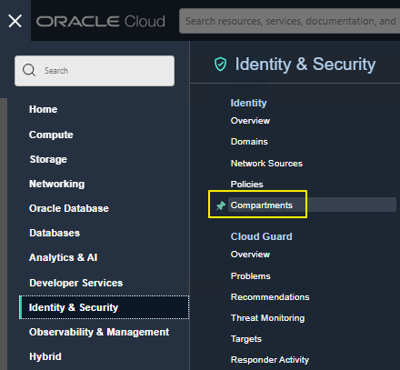

**Create Compartment (구획 생성)** 버튼을 클릭합니다.

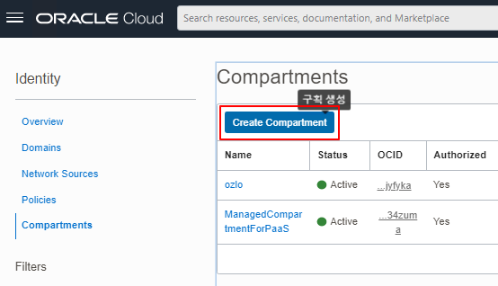

**Name (이름)** 과 **Description (설명)** 을 적고   
**Create Compartment (구획 생성)** 버튼을 클릭합니다.

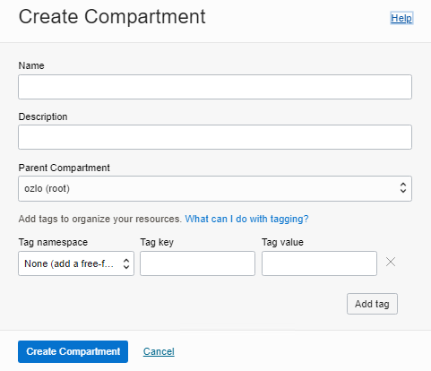

**1st** 라는 구획이 생성된 것을 확인할 수 있습니다.

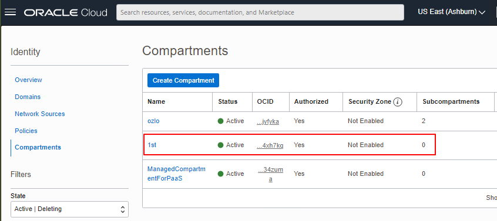

***
## 2. 가상 클라우드 네트워크 (Virtual Cloud Networks)

 메뉴 버튼을 누르고,  
**Networking (네트워킹)** 메뉴를 선택한 후   
**Virtual Cloud Networks (가상 클라우드 네트워크)** 를 클릭합니다.

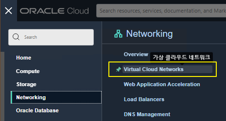

**List Scope (목록 범위)** > **Compartment (구획)** > **1st (자신이 만든 구획 이름)** 를 클릭합니다.

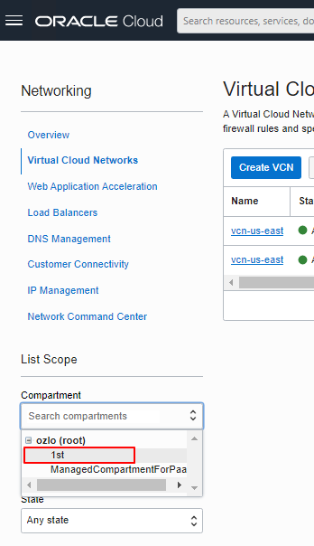

**Start VCN Wizard (VCN 마법사 시작)** 버튼을 클릭합니다.

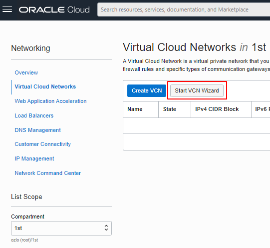

**Create VCN with Internet Connectivity (인터넷 접속을 통한 VCN)** 선택 후   
**Start VCN Wizard (VCN 마법사 시작)** 버튼을 클릭합니다.

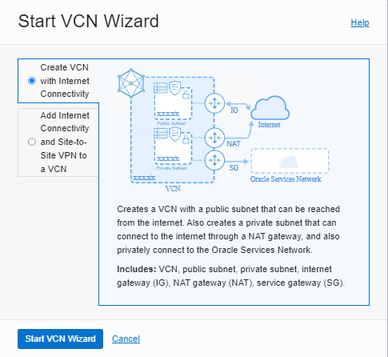

Basic Information (기본 정보)에 **VCN Name (VCN 이름)** 에 적당한 이름을 넣고,   
**Next (다음)** 버튼을 클릭합니다.

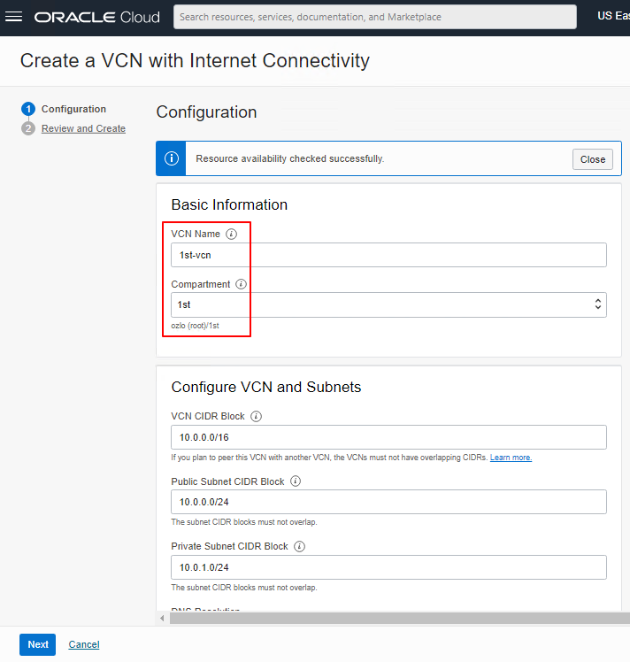

Review and Create (검토 및 생성) 화면에서 내용을 확인한 후,  
**Create (생성)** 버튼을 클릭합니다.

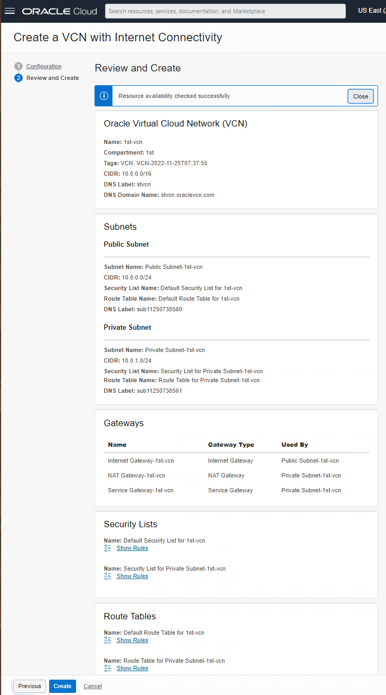

Virtual Cloud Network (가상 클라우드 네트워크) 생성 진행상황을 볼 수 있고,   
아래 그림과 같이 완료된 화면이 나옵니다.

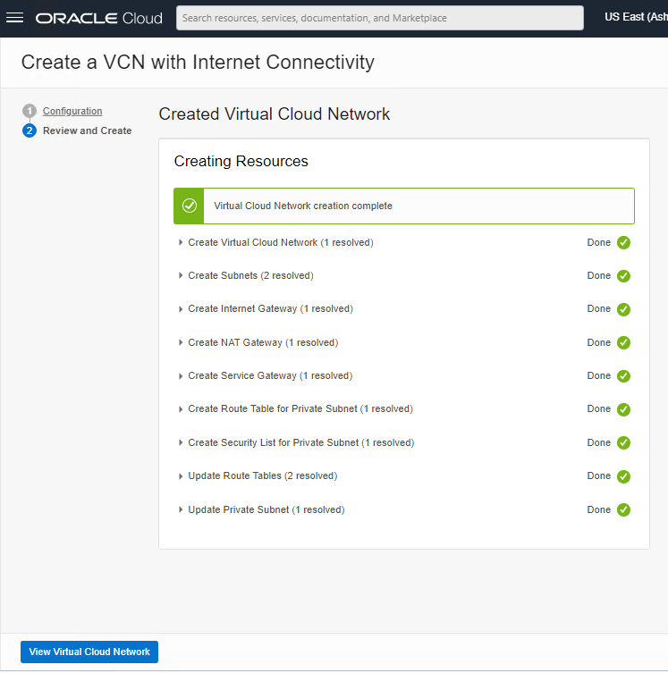

**View Virtual Cloud Network (가상 클라우드 네트워크 보기)** 버튼을 누릅니다.

아래와 같이 **Compartment (구획): 1st** 와 **VCN (가상 네트워크): 1st-vcn** 를 확인할 수 있습니다.

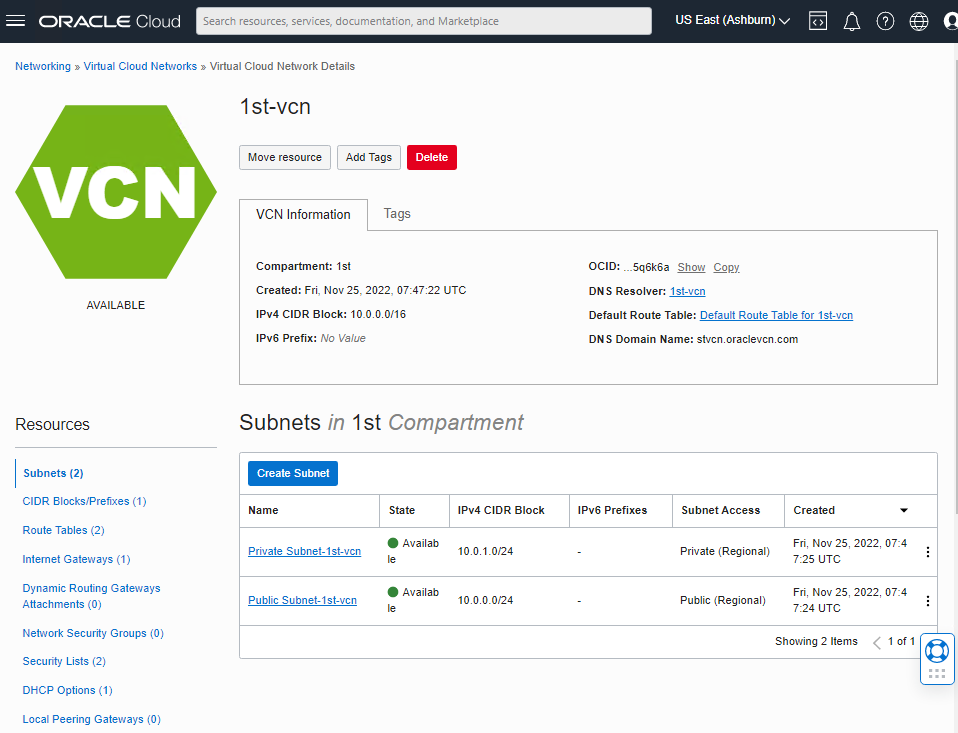

***
## 3. 보안 목록 (Security Lists)

왼쪽 **Resources (리소스)** 항목 아래에 **Security Lists (보안 목록)** 을 클릭하고, **Security List for Private Subnet-1st-vcn** 을 클릭합니다.

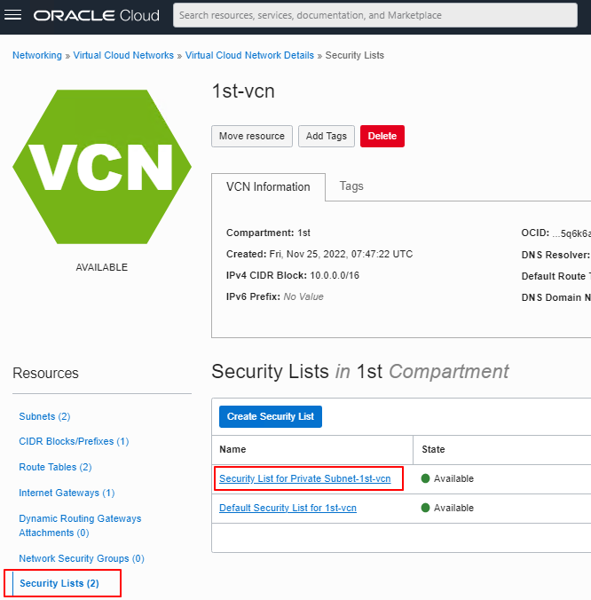

Ingress Rules (수신 규칙)에 TCP 22 (SSH) 포트만 설정된 것을 확인할 수 있습니다.

추가로 포트를 오픈하고자 하면 **Add Ingress Rules (수신 규칙 추가)** 버튼을 클릭하여   
원하는 규칙을 추가할 수 있습니다.

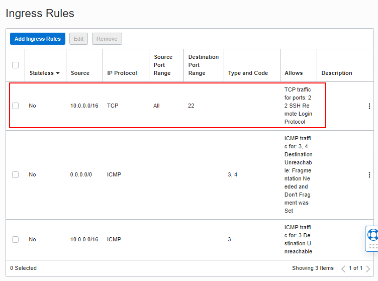

Egress Rules (송신 규칙)은 기본적으로 모두 오픈되어 있습니다.

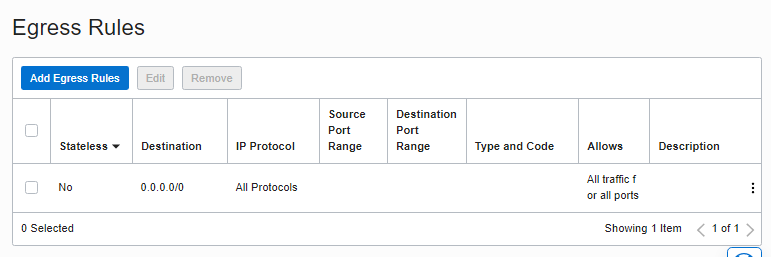

***
## 4. 공용 IP (Reserved Public IPs)

 메뉴 버튼을 누르고,
**Networking (네트워킹)** 메뉴를 선택한 후    
**Reserved Public IPs (IP 관리)** 를 클릭합니다.

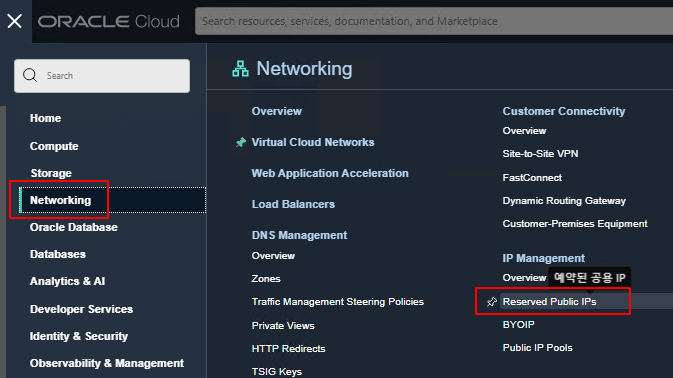

**Reserved Public IP Address (예약된 공용 IP 주소)** 버튼을 클릭합니다.

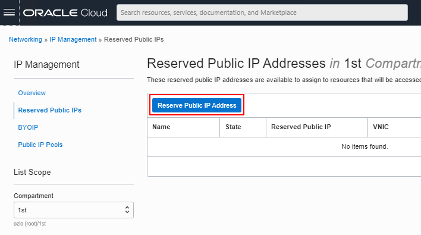

**Reserved Public IP Address Name (예약된 공용 IP 주소 이름)** 에 원하는 이름을 적고,   
**Reserved Public IP Address (예약된 공용 IP 주소)** 버튼을 클릭합니다.

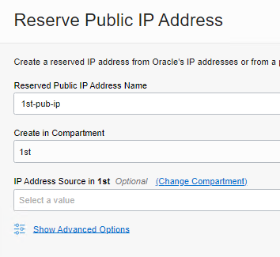

아래와 같이 공용 IP 주소를 확인할 수 있습니다.

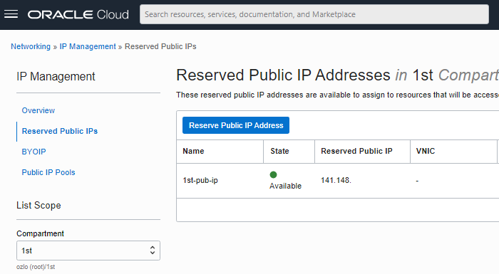

***
## 5. 인스턴스 생성 (Instances)

 메뉴 버튼을 누르고, 
**Compute (컴퓨트)** 메뉴를 선택한 후  
**Instances (인스턴스)** 를 클릭합니다.

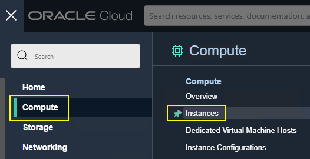

또는 화면 왼쪽 상단의  를 클릭하면   
홈 화면으로 돌아오는데 여기에서 **Instances (인스턴스)** 를 클릭합니다.

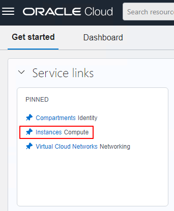

**Create instance (인스턴스 생성)** 버튼을 클릭합니다.

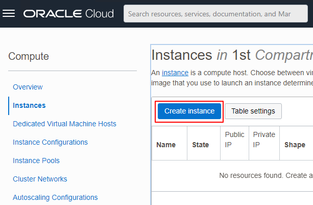

***
> ### 5.1 Name (이름)

**Name (이름)** 항목에 자신이 원하는 이름을 적습니다.

**Placement (배치)** 항목의 **Edit (편집)** 을 클릭하거나   
**Images and shape (이미지 및 구성)** 항목의 **Edit (편집)** 을 클릭하면

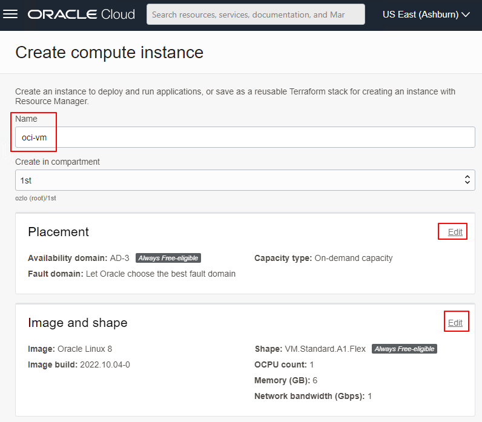

***
> ### 5.2 Placement (배치)

**Placement (배치)** 에서는 Availability domain (가용성 도메인)을 변경할 수 있습니다.

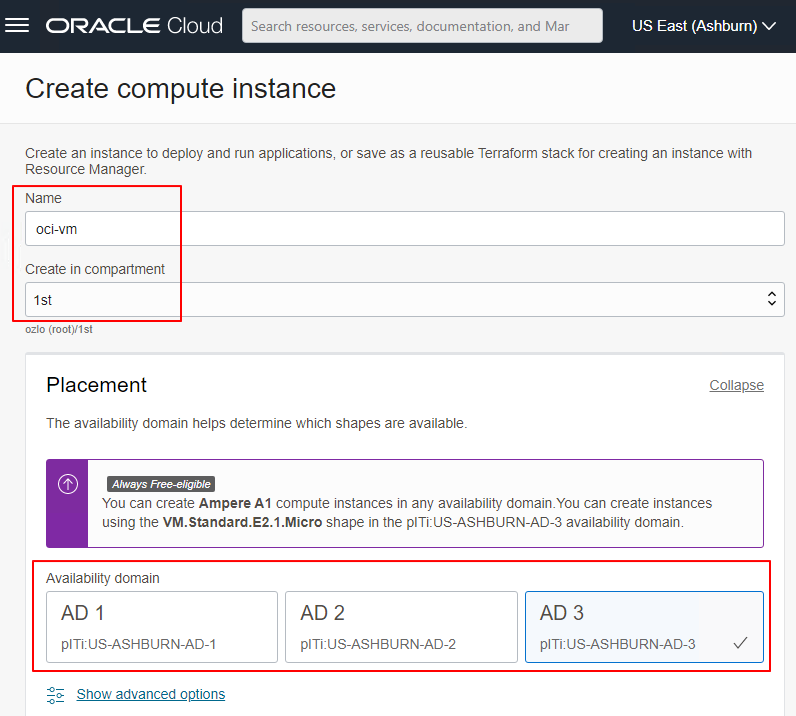

***
> ### 5.3 Images (이미지)

**Images and shape (이미지 및 구성)** 에서는 OS 이미지를 변경할 수 있습니다.

기본 OS 이미지는 Oralce Linux 입니다.

**Change image (이미지 변경)** 버튼을 눌러 변경할 수 있습니다.

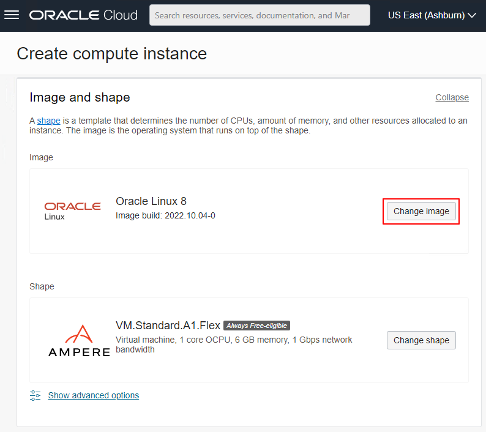

Ubuntu, CentOS, Oracle Linux, Windows 등의 OS와 버전을 선택할 수 있습니다.

Canonical Ubuntu 20.04 버전을 선택하겠습니다.

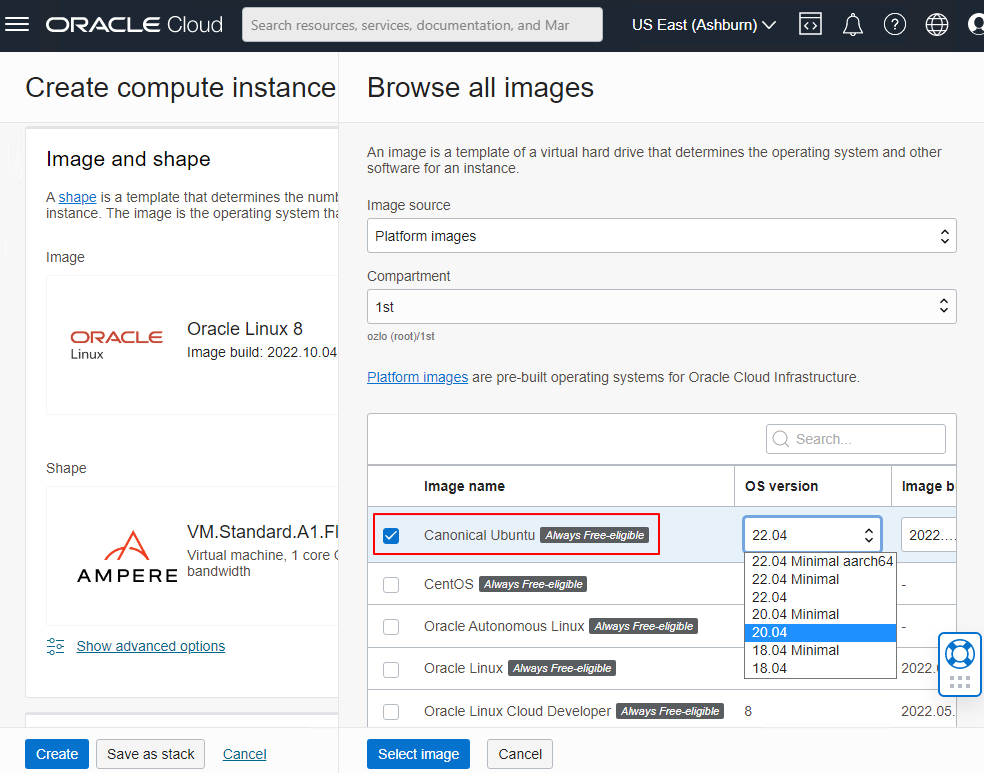

하단의 **Select image (이미지 선택)** 버튼을 누릅니다.

OS 이미지가 Oracle Linux에서 Canonical Ubuntu로 바뀐 것을 확인할 수 있습니다.

**Shape (구성)** 의 **Change shape (구성편집)** 버튼을 누르면   
CPU 타입별 구성을 선택할 수 있습니다.

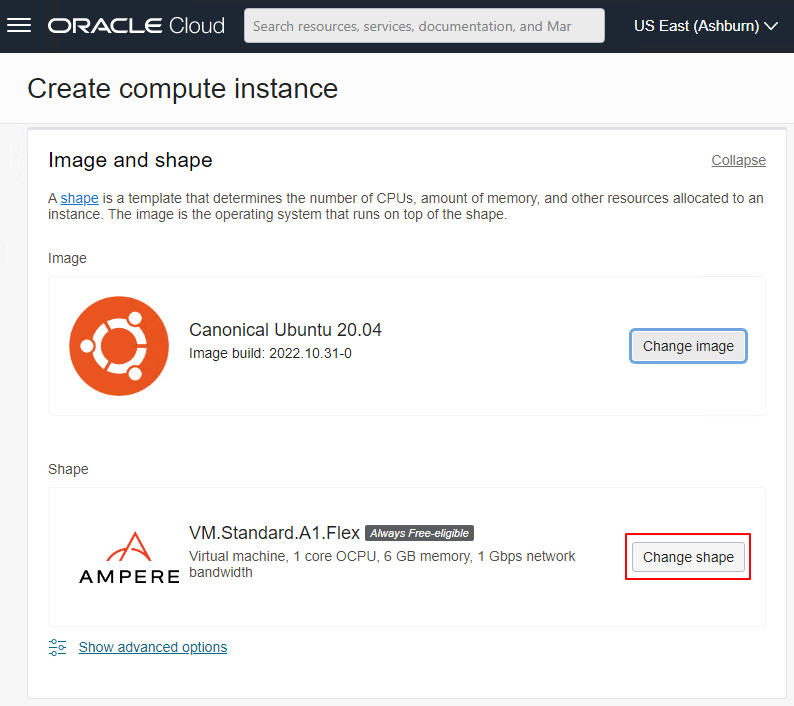

***
> ### 5.4 Shape (구성)

**AMD** 를 선택했을 때의 화면입니다.

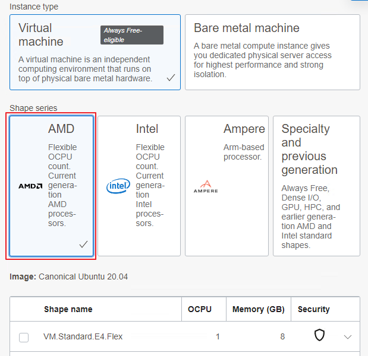

**Intel** 을 선택했을 때의 화면입니다.

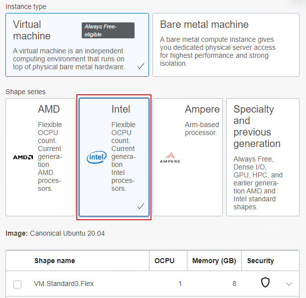

**Ampere** 를 선택했을 때의 화면입니다.  
**Always Free-eligible (항상 무로 적격)** 이 표시된 것을 확인할 수 있습니다.

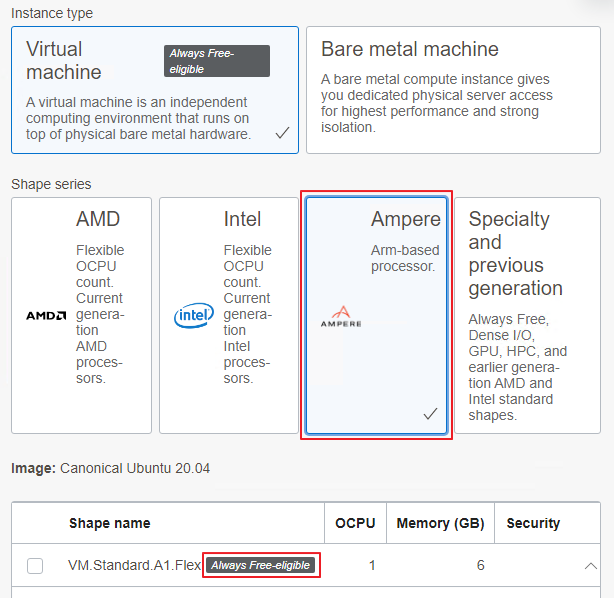

**Specialty and previous generation (특수성 및 이전 세대)** 을 선택했을 때의 화면입니다.

**AMD CPU** 기반 구성이면서 **Always Free-eligible (항상 무로 적격)** 이 표시된 것을 확인할 수 있습니다.

이것을 선택하겠습니다.

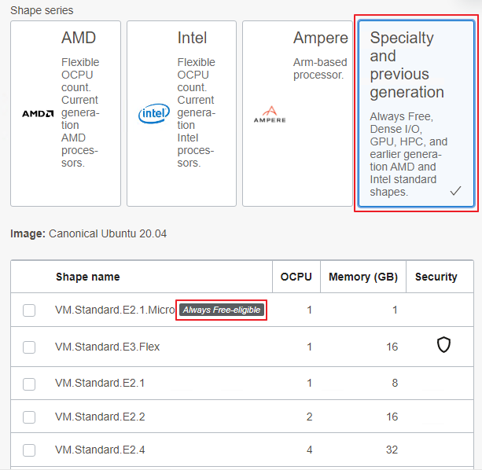

Shape (구성)가 Ampere에서 AMD로 바뀐 것을 확인할 수 있습니다.

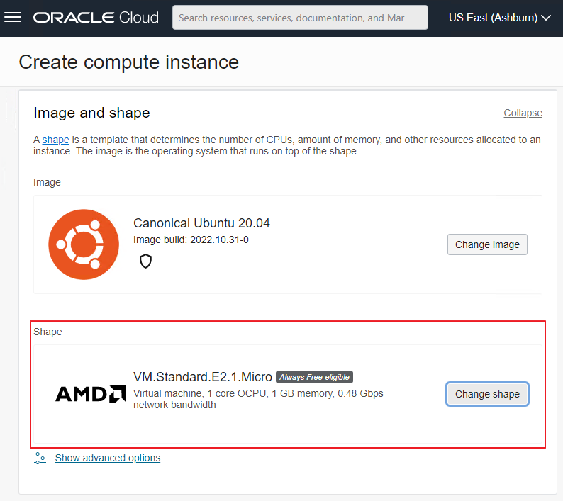

***
> ### 5.5 Networking (네트워킹)

**Networking (네트워킹)** 의 **Edit (편집)** 를 눌러 네트워크 설정을 변경할 수 있습니다.

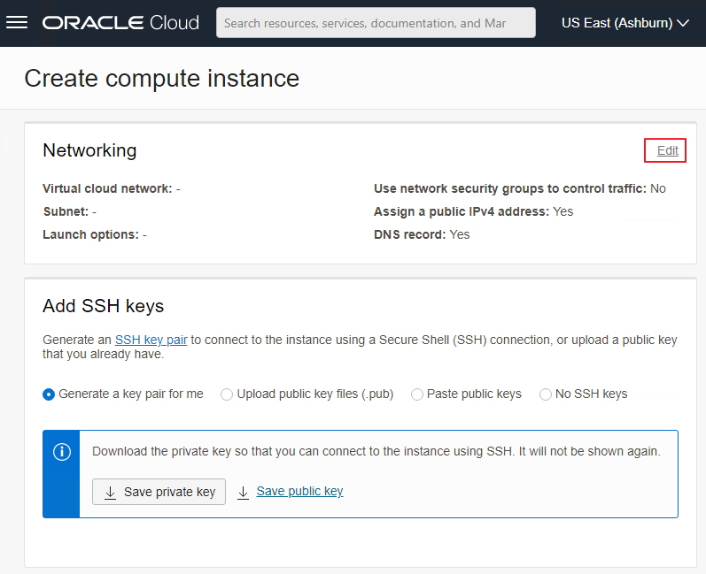

Virtual Cloud Network (가상 클라우드 네트워크), Subnet (서브넷), Public IPv4 address (공용 IPv4 주소) 설정을 변경할 수 있습니다.

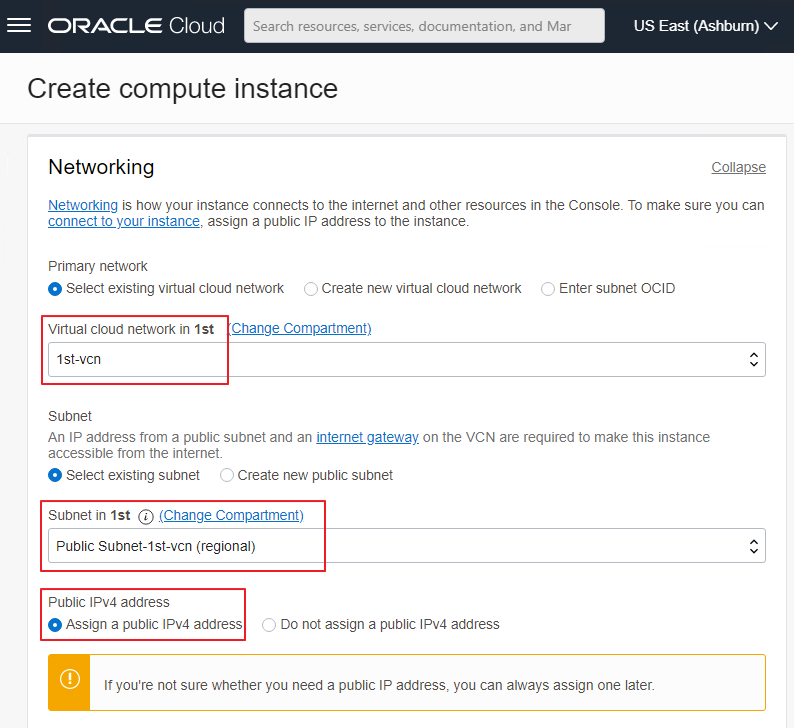

**Subnet (서브넷)** 을 누르면   
Public subnets (공용 서브넷)과 Private subnets (전용 서브넷)을 선택할 수 있습니다.

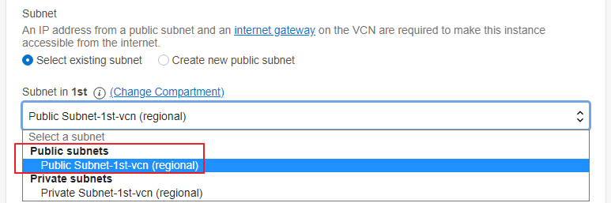

**Advanced options (고급 옵션 표시)** 를 클릭하면   
인스턴스의 사설 IP와 호스트 이름을 미리 지정할 수 있습니다.

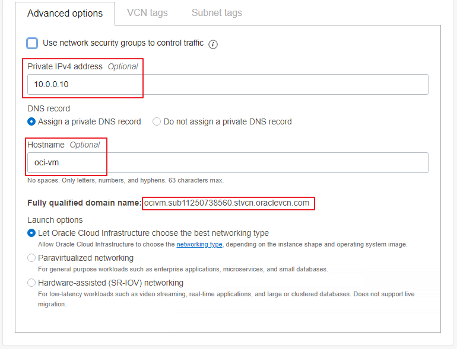

***
> ### 5.6 Add SSH keys

인스턴스에 접속하기 위한 SSH 키를 추가하는 메뉴입니다.

오라클 클라우드에서 생성해준 private key (전용 키)와 public key (공용 키)를 다운로드하여 사용할 수 있습니다.

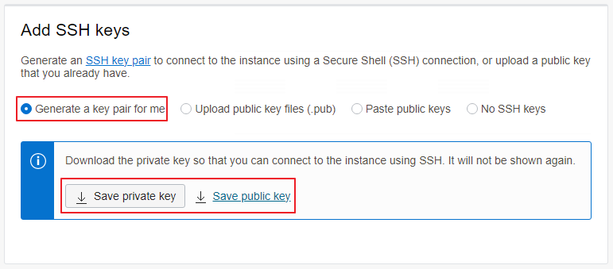

기존에 사용하던 public key (공용 키)를 텍스트로 복사한 후 붙여넣기로 사용할 수 있습니다.

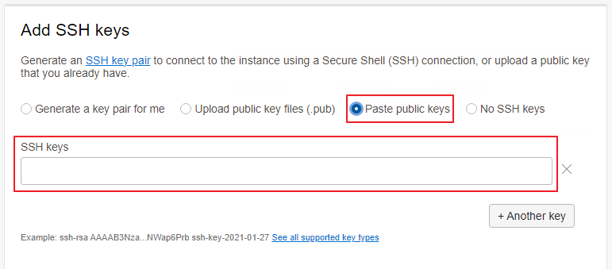

***
> ### 5.7 Boot volume (부트 볼륨)

Boot volume (부트 볼륨) 크기도 설정 가능합니다.   
왼쪽 체크박스를 누르면

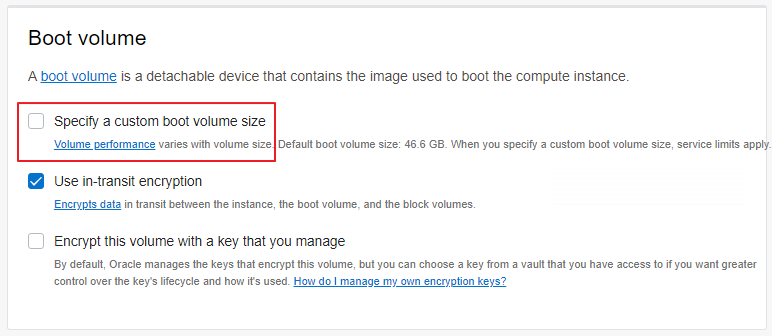

아래와 같이 설정 화면이 나옵니다.

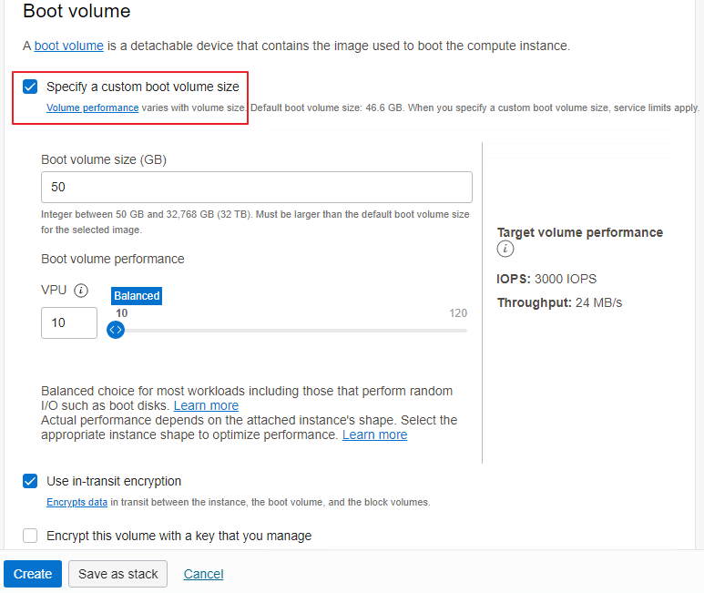

모든 설정을 마쳤으면 아래 **Create (생성)** 버튼을 클릭합니다.

***
> ### 5.8 Information

Instance (인스턴스)
생성이 완료된 화면으로 인스턴스 정보를 확인할 수 있습니다.

- OS 이미지 정보 (Image)
- 구성 정보 (Shape)
- 공용 IP 정보 (Public IP)
- 전용 IP 정보 (Private IP)

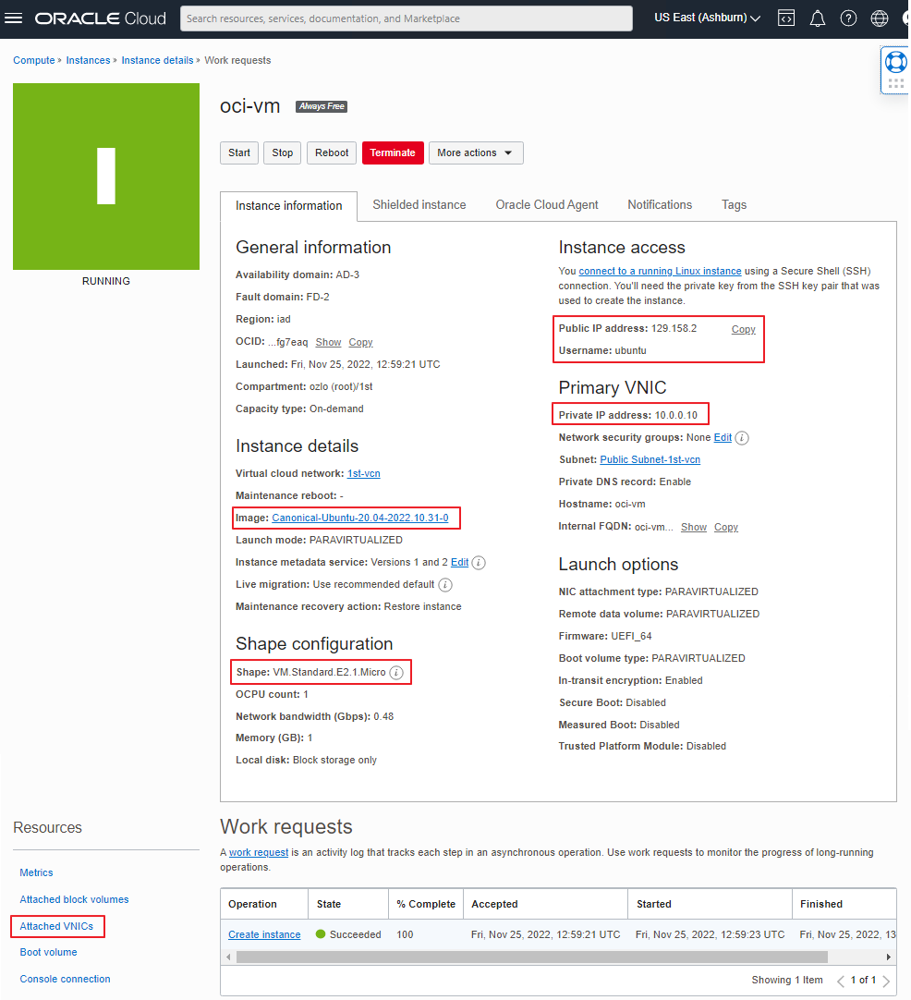

***
> ### 5.9 Public IP (공용 IP)

사전에 생성한 Pubic IP (공용 IP)를 사용하려면   
왼쪽 하단의 **Attached VNICs (연결된 VNIC)** 을 클릭합니다.

현재 설정된 내용을 확인할 수 있습니다. Name 항목의 인스턴스 이름을 클릭합니다.

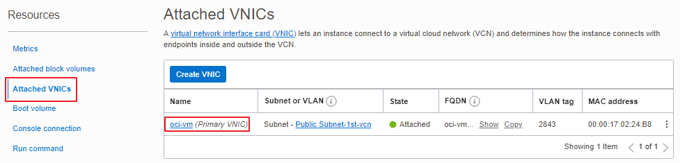

VNIC 정보와 Public IP (공용 IP) 확인할 수 있습니다.

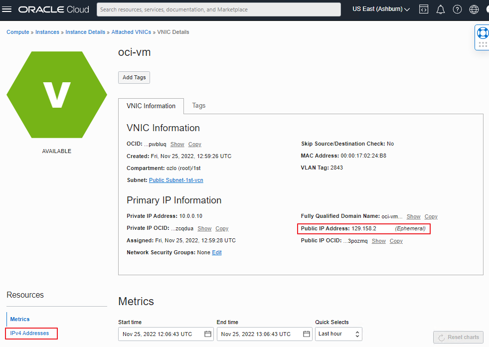

IPv4 Address 항목의 Private IP Address (전용 IP 주소)의    
오른쪽 끝의 점 3개를 클릭한 후 Edit (편집)를 누릅니다.

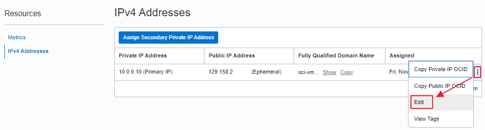

Public IP Type (공용 IP 유형)에서 No public IP (공용 IP 없음)을 선택 후    
Update (업데이트)를 누릅니다. 자동으로 생성된 Public IP (공용 IP)를 제거하는 작업입니다.

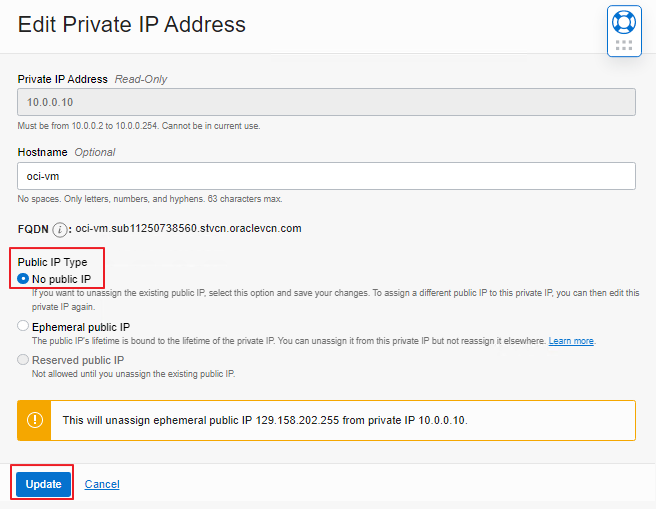

IPv4 Address에서 Public IP Address (공용 IP 주소) 가 비어 있는 것을 확인할 수 있습니다.

다시 오른쪽 끝 점 3개를 클릭한 후 Edit (편집)를 누릅니다.

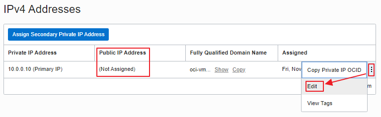

Public IP Type (공용 IP 유형)에서 Reserved public IP (예약된 공용 IP)을 클릭하면    
Select Existing Reserved IP Address (기존 예약된 IP 주소 선택) 메뉴가 나오고,    
값을 선택할 수 있습니다.

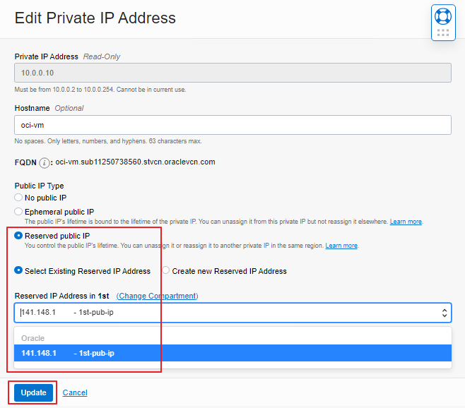

Update (업데이트)를 누릅니다.

사전에 생성한 Pubic IP (공용 IP)로 변경된 것을 확인할 수 있습니다.

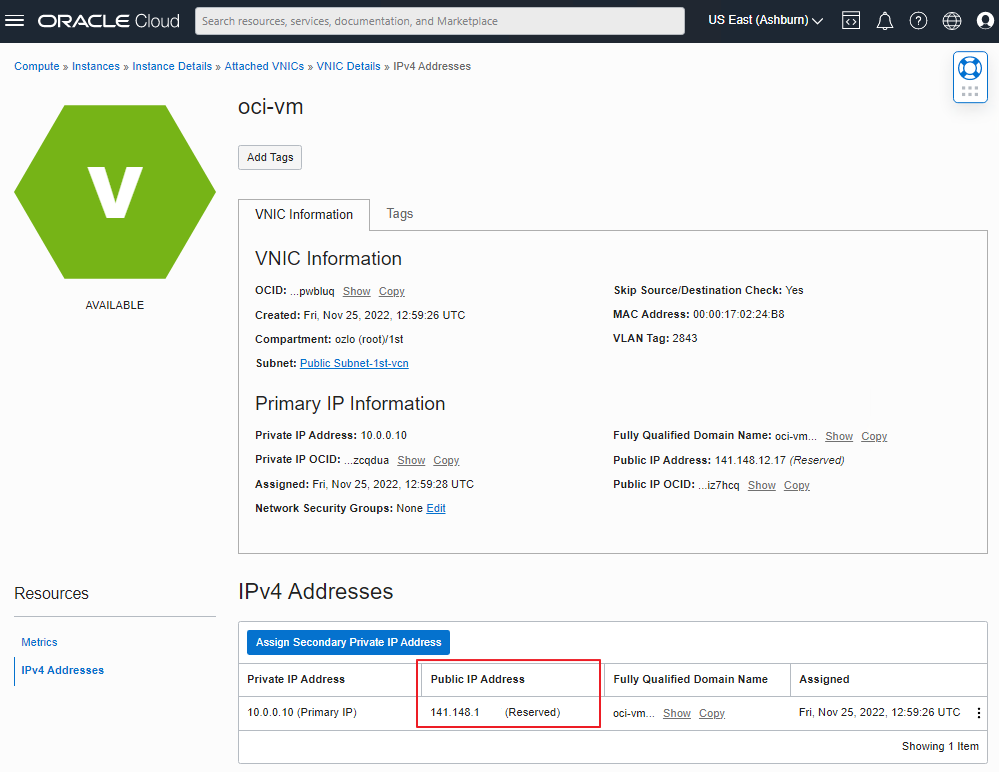

***
## 6. Ubuntu 서버 Swap 설정

이 예제로 생성한 Ubuntu 서버는 메모리 1G로 RAM 부족으로 인한 오류 방지를 위해 스왑 설정을 해줌 

- Ubuntu 20.04 Add Swap Space 문서 참조: https://github.com/20eung/ubuntu-swap

***
> ### 참고 링크

- 오라클 클라우드 구획, 가상 네트워크, 방화벽, 공용IP 설정하기 : https://www.wsgvet.com/cloud/4

- 오라클 클라우드 인스턴스 생성, SSH 접속하기 : https://www.wsgvet.com/cloud/5
