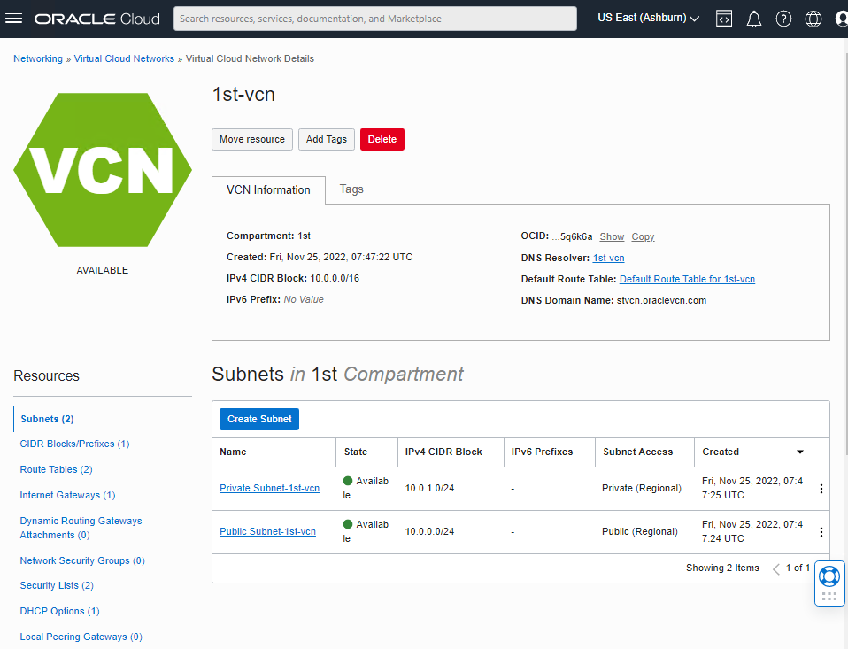
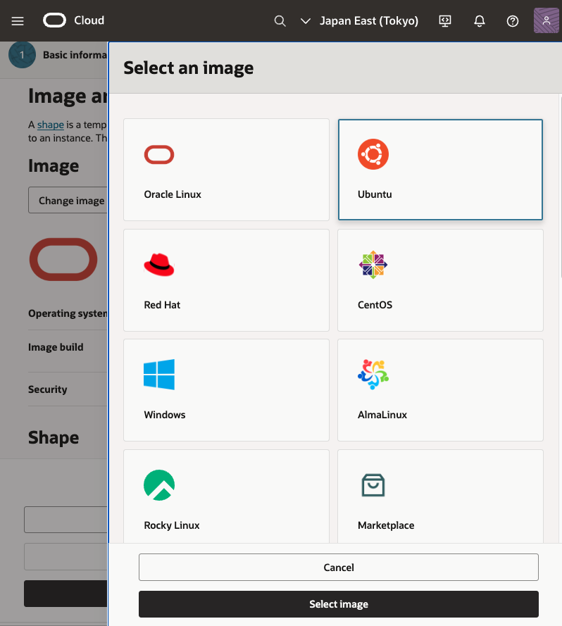

# Oracle Cloud 처음 사용자용

### 목차

1. [구획 생성 (Compartments)](#1-구획-생성-compartments)

2. [가상 클라우드 네트워크 (Virtual Cloud Networks)](#2-가상-클라우드-네트워크-virtual-cloud-networks)

3. [보안 목록 (Security Lists)](#3-보안-목록-security-lists)

4. [공용 IP (Reserved Public IPs)](#4-공용-ip-reserved-public-ips)

5. [인스턴스 생성 (Instances)](#5-인스턴스-생성-instances)

    5.1 [Name (이름)](#51-name-이름)

    5.2 [Placement (배치)](#52-placement-배치)

    5.3 [Images (이미지)](#53-images-이미지)

    5.4 [Shape (구성)](#54-shape-구성)

    5.5 [Networking (네트워킹)](#55-networking-네트워킹)

    5.6 [Add SSH keys](#56-add-ssh-keys)

    5.7 [Boot volume (부트 볼륨)](#57-boot-volume-부트-볼륨)

    5.8 [Information (인스턴스 정보)](#58-information)

    5.9 [Public IP (공용 IP)](#59-public-ip-공용-ip)

6. [네트워크 보안 그룹 (Network Security Group)](#6-네트워크-보안-그룹-network-security-group)

7. [Ubuntu 서버 Swap 설정](#7-ubuntu-서버-swap-설정)


[참고 링크](#참고-링크)


***
## 1. 구획 생성 (Compartments)

 메뉴 버튼을 누르고,   
**Identity & Security (거버넌스 및 관리)** 메뉴를 선택한 후   
**Compartments (구획)** 를 클릭합니다.


**Create Compartment (구획 생성)** 버튼을 클릭합니다.


**Name (이름)** 과 **Description (설명)** 을 적고   
**Create Compartment (구획 생성)** 버튼을 클릭합니다.


**1st** 라는 구획이 생성된 것을 확인할 수 있습니다.


***
## 2. 가상 클라우드 네트워크 (Virtual Cloud Networks)

 메뉴 버튼을 누르고,  
**Networking (네트워킹)** 메뉴를 선택한 후   
**Virtual Cloud Networks (가상 클라우드 네트워크)** 를 클릭합니다.


**List Scope (목록 범위)** > **Compartment (구획)** > **1st (자신이 만든 구획 이름)** 를 클릭합니다.


**Start VCN Wizard (VCN 마법사 시작)** 버튼을 클릭합니다.


**Create VCN with Internet Connectivity (인터넷 접속을 통한 VCN)** 선택 후   
**Start VCN Wizard (VCN 마법사 시작)** 버튼을 클릭합니다.


Basic Information (기본 정보)에 **VCN Name (VCN 이름)** 에 적당한 이름을 넣고,   
**Next (다음)** 버튼을 클릭합니다.


Review and Create (검토 및 생성) 화면에서 내용을 확인한 후,  
**Create (생성)** 버튼을 클릭합니다.


Virtual Cloud Network (가상 클라우드 네트워크) 생성 진행상황을 볼 수 있고,   
아래 그림과 같이 완료된 화면이 나옵니다.


**View Virtual Cloud Network (가상 클라우드 네트워크 보기)** 버튼을 누릅니다.

아래와 같이 **Compartment (구획): 1st** 와 **VCN (가상 네트워크): 1st-vcn** 를 확인할 수 있습니다.




***
## 3. 보안 목록 (Security Lists)

왼쪽 **Resources (리소스)** 항목 아래에 **Security Lists (보안 목록)** 을 클릭하고, **Security List for Private Subnet-1st-vcn** 을 클릭합니다.


Ingress Rules (수신 규칙)에 TCP 22 (SSH) 포트만 설정된 것을 확인할 수 있습니다.

추가로 포트를 오픈하고자 하면 **Add Ingress Rules (수신 규칙 추가)** 버튼을 클릭하여   
원하는 규칙을 추가할 수 있습니다.


Egress Rules (송신 규칙)은 기본적으로 모두 오픈되어 있습니다.


***
## 4. 공용 IP (Reserved Public IPs)

 메뉴 버튼을 누르고,
**Networking (네트워킹)** 메뉴를 선택한 후    
**Reserved Public IPs (IP 관리)** 를 클릭합니다.


**Reserved Public IP Address (예약된 공용 IP 주소)** 버튼을 클릭합니다.


**Reserved Public IP Address Name (예약된 공용 IP 주소 이름)** 에 원하는 이름을 적고,   
**Reserved Public IP Address (예약된 공용 IP 주소)** 버튼을 클릭합니다.


아래와 같이 공용 IP 주소를 확인할 수 있습니다.


***

> [!WARNING]
> **Always Free 인스턴스 유휴 회수 정책 (중요)**
>
> Oracle Cloud는 Always Free 인스턴스가 **7일 연속**으로 아래 기준 미만인 유휴 상태일 경우,
> 인스턴스를 자동으로 **중지하거나 회수**할 수 있습니다.
> - CPU 평균 사용률 10% 미만
> - 네트워크 수신 500MB / 7일 미만
>
> **방지 방법**: `cron`으로 주기적으로 부하를 발생시키는 스크립트를 등록합니다.
>
> ```bash
> # crontab -e 로 등록 (매 10분마다 간단한 연산 실행)
> */10 * * * * /usr/bin/sha256sum /dev/urandom | head -c 1M > /dev/null 2>&1
> ```
>
> 또는 실제 서비스(웹서버, 봇 등)를 상시 실행하면 자연스럽게 회수를 방지할 수 있습니다.

## 5. 인스턴스 생성 (Instances)

 메뉴 버튼을 누르고, 
**Compute (컴퓨트)** 메뉴를 선택한 후  
**Instances (인스턴스)** 를 클릭합니다.


또는 화면 왼쪽 상단의  를 클릭하면   
홈 화면으로 돌아오는데 여기에서 **Instances (인스턴스)** 를 클릭합니다.


**Create instance (인스턴스 생성)** 버튼을 클릭합니다.


***
> ### 5.1 Name (이름)

**Name (이름)** 항목에 자신이 원하는 이름을 적습니다.

**Placement (배치)** 항목의 **Edit (편집)** 을 클릭하거나   
**Images and shape (이미지 및 구성)** 항목의 **Edit (편집)** 을 클릭하면


***
> ### 5.2 Placement (배치)

**Placement (배치)** 에서는 Availability domain (가용성 도메인)을 변경할 수 있습니다.


***
> ### 5.3 Images (이미지)

**Images and shape (이미지 및 구성)** 에서는 OS 이미지를 변경할 수 있습니다.

기본 OS 이미지는 Oralce Linux 입니다.

**Change image (이미지 변경)** 버튼을 눌러 변경할 수 있습니다.




Ubuntu, CentOS, Oracle Linux, Windows 등의 OS와 버전을 선택할 수 있습니다.

**Canonical Ubuntu 24.04 LTS** 버전을 선택하겠습니다.

> 2026년 기준 표준 지원 중 (2029년 4월까지 지원)
> Ubuntu 20.04 LTS는 2025년부터 ESM(확장 보안 유지보수)으로 전환되었으므로 24.04 LTS를 권장합니다.


하단의 **Select image (이미지 선택)** 버튼을 누릅니다.


OS 이미지가 Oracle Linux에서 Canonical Ubuntu로 바뀐 것을 확인할 수 있습니다.

**Shape (구성)** 의 **Change shape (구성편집)** 버튼을 누르면   
CPU 타입별 구성을 선택할 수 있습니다.


***
> ### 5.4 Shape (구성)

**AMD** 를 선택했을 때의 화면입니다.


**Intel** 을 선택했을 때의 화면입니다.


**Ampere** 를 선택했을 때의 화면입니다.  
**Always Free-eligible (항상 무료 적격)** 이 표시된 것을 확인할 수 있습니다.


> **Oracle Always Free의 핵심 혜택 — Ampere A1 Flex**
>
> Ampere A1 Compute (VM.Standard.A1.Flex) 는 **무료**임에도 아래와 같은 파격적인 스펙을 제공합니다:
>
> | 항목 | 내용 |
> |------|------|
> | 총 무료 할당량 | **4 OCPU + 24 GB RAM** (월 기준) |
> | 활용 방법 | 1개 인스턴스에 4 OCPU / 24 GB 전부 할당 가능 |
> | 분산 사용 | 또는 최대 4개 인스턴스로 나눠서 사용 가능 |
> | 네트워크 | OCPU당 1 Gbps 대역폭 |
>
> 이는 AWS, GCP 등 다른 클라우드 무료 티어와 비교하면 압도적인 수준입니다.
> 초보자라면 **Ampere A1 Flex (4 OCPU / 24 GB)** 단일 인스턴스 구성을 강력히 권장합니다.

**VM.Standard.A1.Flex** (Ampere) 를 선택하고, OCPU와 메모리를 원하는 값으로 설정합니다.


***
> ### 5.5 Networking (네트워킹)

**Networking (네트워킹)** 의 **Edit (편집)** 를 눌러 네트워크 설정을 변경할 수 있습니다.


Virtual Cloud Network (가상 클라우드 네트워크), Subnet (서브넷), Public IPv4 address (공용 IPv4 주소) 설정을 변경할 수 있습니다.


**Subnet (서브넷)** 을 누르면   
Public subnets (공용 서브넷)과 Private subnets (전용 서브넷)을 선택할 수 있습니다.


**Advanced options (고급 옵션 표시)** 를 클릭하면   
인스턴스의 사설 IP와 호스트 이름을 미리 지정할 수 있습니다.


***
> ### 5.6 Add SSH keys

인스턴스에 접속하기 위한 SSH 키를 추가하는 메뉴입니다.

오라클 클라우드에서 생성해준 private key (전용 키)와 public key (공용 키)를 다운로드하여 사용할 수 있습니다.


기존에 사용하던 public key (공용 키)를 텍스트로 복사한 후 붙여넣기로 사용할 수 있습니다.


#### SSH 키를 직접 생성하는 방법 (초보자 권장)

SSH 키가 없다면 아래 방법으로 직접 생성할 수 있습니다.

**Mac / Linux / Windows 11 터미널**

```bash
ssh-keygen -t rsa -b 4096 -C "your_email@example.com"
# 저장 경로 물음: Enter 로 기본값(~/.ssh/id_rsa) 사용
# 비밀번호 물음: Enter 로 생략 가능
```

생성 후 공개 키를 확인합니다:

```bash
cat ~/.ssh/id_rsa.pub
```

**Windows PowerShell**

```powershell
ssh-keygen -t rsa -b 4096
# 생성 후 공개 키 확인:
type $env:USERPROFILE\.ssh\id_rsa.pub
```

위에서 출력된 `ssh-rsa AAAA...` 로 시작하는 공개 키 전체를 복사하여   
OCI 콘솔의 **Paste public keys** 란에 붙여넣습니다.


***
> ### 5.7 Boot volume (부트 볼륨)

Boot volume (부트 볼륨) 크기도 설정 가능합니다.   
왼쪽 체크박스를 누르면


아래와 같이 설정 화면이 나옵니다.


모든 설정을 마쳤으면 아래 **Create (생성)** 버튼을 클릭합니다.


***
> ### 5.8 Information

Instance (인스턴스)
생성이 완료된 화면으로 인스턴스 정보를 확인할 수 있습니다.

- OS 이미지 정보 (Image)
- 구성 정보 (Shape)
- 공용 IP 정보 (Public IP)
- 전용 IP 정보 (Private IP)


***
> ### 5.9 Public IP (공용 IP)

사전에 생성한 Pubic IP (공용 IP)를 사용하려면   
왼쪽 하단의 **Attached VNICs (연결된 VNIC)** 을 클릭합니다.

현재 설정된 내용을 확인할 수 있습니다. Name 항목의 인스턴스 이름을 클릭합니다.


VNIC 정보와 Public IP (공용 IP) 확인할 수 있습니다.


IPv4 Address 항목의 Private IP Address (전용 IP 주소)의    
오른쪽 끝의 점 3개를 클릭한 후 Edit (편집)를 누릅니다.


Public IP Type (공용 IP 유형)에서 No public IP (공용 IP 없음)을 선택 후    
Update (업데이트)를 누릅니다. 자동으로 생성된 Public IP (공용 IP)를 제거하는 작업입니다.


IPv4 Address에서 Public IP Address (공용 IP 주소) 가 비어 있는 것을 확인할 수 있습니다.

다시 오른쪽 끝 점 3개를 클릭한 후 Edit (편집)를 누릅니다.


Public IP Type (공용 IP 유형)에서 Reserved public IP (예약된 공용 IP)을 클릭하면    
Select Existing Reserved IP Address (기존 예약된 IP 주소 선택) 메뉴가 나오고,    
값을 선택할 수 있습니다.


Update (업데이트)를 누릅니다.

사전에 생성한 Pubic IP (공용 IP)로 변경된 것을 확인할 수 있습니다.


***
## 6. 네트워크 보안 그룹 (Network Security Group)


> ### 6.1 보안 목록(Security Lists)과 네트워크 보안 그룹(Network Security Groups) 차이점

| 보안 도구 | 적용 대상 | 사용 방법 | 제한 사항 |
|----------|----------|----------|----------|
| 보안 목록 | 서브넷의 모든 VNIC | 서브넷에 연결 | 서브넷 당 최대 5개 |
| 네트워크 보안 그룹 | 동일한 VCN의 선택된 NVIC | VNIC에 추가 | VNIC당 최대 5개 |

네트워크 보안 그룹(Network Security Groups)를 사용하면 애플리케이션 보안 요구 사항에서 VCN의 서브넷 아키텍처를 분리할 수 있으므로 Oracle은 보안 목록 대신 NSG를 사용할 것을 권장합니다.


> ### 6.2 **Network Security Group (네트워크 보안 그룹)** 만들기

**VCN (가상 클라우드 네트워크) 등록 정보** 화면의 왼쪽에 있는 Resources (리소스) 중 **Network Security Group (네트워크 보안 그룹)** 을 클릭하고,   
**Create Network Security Group (네트워크 보안 그룹 생성)** 버튼을 누릅니다.


**Name (이름)** 을 적고 다음 버튼을 누릅니다.


**Add Security Rules (보안 규칙 추가)** 의 Rule (규칙)에 보안 규칙을 정의한 후 Create (생성) 버튼을 클릭합니다.

- Direction(방향): Ingress(수신), Egress(송신)
- Source Type(소스 유형): CIDR, Services(서비스), NSG(네트워크 보안 그룹)
- IP Protocol: ICMP, RDP, SSH, TCP, UDP, 모든 프로토콜 등
- Destination Port Range(대상 포트 범위): 콤마(,)로 여러 개 입력 가능


생성된 Security Rules (보안 규칙)을 확인할 수 있습니다.   
**Add Rules (규칙 추가)** 버튼을 눌러 여러 개의 규칙을 추가할 수 있습니다.


> ### 6.3 **Network Security Group (네트워크 보안 그룹)** 을 인스턴스에 적용하기

 메뉴 버튼을 누르고, 
**Compute (컴퓨트)** 메뉴를 선택한 후  
**Instances (인스턴스)** 를 클릭합니다.

인스턴스를 눌러 **Instance Details (세부 등록 정보)** 화면으로 이동합니다.

왼쪽 Resources (리소스) 메뉴 중 **Attached VNICs (연결된 VNIC)** 를 클릭하고, 
인스턴스와 동일한 **기본 VNIC** 을 클릭하여   
**VNIC 세부 정보** 화면으로 이동합니다.

**Primary IP Information (기본 IP 정보)** 의 **Network Security Groups (네트워크 보안 그룹)** 항목의 **Edit (편집)** 을 클릭합니다.


리스트 박스를 클릭하여 미리 생성한 Network Security Group (네트워크 보안 그룹)을 선택하고, Save changes (변경사항 저장) 버튼을 클릭하여 VNIC에 Network Security Group (네트워크 보안 그룹)을 추가합니다.

이 과정을 최대 5번 반복할 수 있습니다.


***
## 7. Ubuntu 서버 Swap 설정

이 예제로 생성한 Ubuntu 서버는 RAM 부족으로 인한 오류 방지를 위해 스왑 설정을 권장합니다.

> Ampere A1 Flex (24 GB RAM) 를 선택했다면 스왑 설정은 선택 사항입니다.
> AMD VM.Standard.E2.1.Micro (1 GB RAM) 를 사용하는 경우 반드시 설정을 권장합니다.

- Ubuntu 22.04 / 24.04 LTS에서도 동일하게 적용 가능합니다.
- Add Swap Space 문서 참조: https://github.com/20eung/ubuntu-swap


***
> ### 참고 링크

- Docker, Portainer, Watch Tower 설치 방법 : https://github.com/20eung/docker-portainer-watchtower

- 오라클 클라우드 구획, 가상 네트워크, 방화벽, 공용IP 설정하기 : https://www.wsgvet.com/cloud/4

- 오라클 클라우드 인스턴스 생성, SSH 접속하기 : https://www.wsgvet.com/cloud/5
