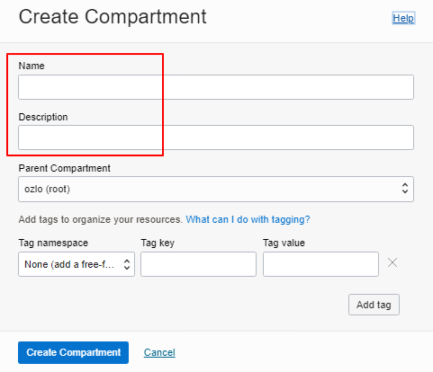

# Oracle Cloud 처음 사용자용

### 목차

[1. 구획 생성 (Compartments)](#1-구획-생성-compartments)

[2. 가상 클라우드 네트워크 (Virtual Cloud Networks)](#2-가상-클라우드-네트워크-virtual-cloud-networks)

[3. 보안 목록(방화벽) (Security Lists)](#3-보안-목록방화벽-security-lists)

[4. 공용 IP (Reserved Public IPs)](#4-공용-ip-reserved-public-ips)

[5. 인스턴스 생성 (Instances)](#5-인스턴스-생성-instances)

#

## 1. 구획 생성 (Compartments)

 메뉴 버튼을 누르고,

**Identity & Security (거버넌스 및 관리)** 메뉴를 선택한 후 **Compartments (구획)** 를 클릭합니다.

**Create Compartment (구획 생성)** 버튼을 클릭합니다.

**Name (이름)** 과 **Description (설명)** 을 적고 **Create Compartment (구획 생성)** 버튼을 클릭합니다.

**1st** 라는 구획이 생성된 것을 확인할 수 있습니다.

## 2. 가상 클라우드 네트워크 (Virtual Cloud Networks)

 메뉴 버튼을 누르고,

**Networking (네트워킹)** 메뉴를 선택한 후 **Virtual Cloud Networks (가상 클라우드 네트워크)** 를 클릭합니다.

**List Scope (목록 범위)** > **Compartment (구획)** > **1st (자신이 만든 구획 이름)** 를 클릭합니다.

**Start VCN Wizard (VCN 마법사 시작)** 버튼을 클릭합니다.

**Create VCN with Internet Connectivity (인터넷 접속을 통한 VCN)** 선택 후 **Start VCN Wizard (VCN 마법사 시작)** 버튼을 클릭합니다.

Basic Information (기본 정보)에 **VCN Name (VCN 이름)** 에 적당한 이름을 넣고, **Next (다음)** 버튼을 클릭합니다.

Review and Create (검토 및 생성) 화면에서 내용을 확인한 후, **Create (생성)** 버튼을 클릭합니다.

Virtual Cloud Network (가상 클라우드 네트워크) 생성 진행상황을 볼 수 있고, 아래 그림과 같이 완료된 화면이 나옵니다.

**View Virtual Cloud Network (가상 클라우드 네트워크 보기)** 버튼을 누릅니다.

아래와 같이 **Compartment (구획): 1st** 와 **VCN (가상 네트워크): 1st-vcn** 를 확인할 수 있습니다.

## 3. 보안 목록(방화벽) (Security Lists)

왼쪽 **Resources (리소스)** 항목 아래에 **Security Lists (보안 목록)** 을 클릭하고, **Security List for Private Subnet-1st-vcn** 을 클릭합니다.

Ingress Rules (수신 규칙)에 TCP 22 (SSH) 포트만 설정된 것을 확인할 수 있습니다.

추가로 포트를 오픈하고자 하면 **Add Ingress Rules (수신 규칙 추가)** 버튼을 클릭하여 원하는 규칙을 추가할 수 있습니다.

Egress Rules (송신 규칙)은 기본적으로 모두 오픈되어 있습니다.

## 4. 공용 IP (Reserved Public IPs)

 메뉴 버튼을 누르고,

**Networking (네트워킹)** 메뉴를 선택한 후 **Reserved Public IPs (IP 관리)** 를 클릭합니다.

**Reserved Public IP Address (예약된 공용 IP 주소)** 버튼을 클릭합니다.

**Reserved Public IP Address Name (예약된 공용 IP 주소 이름)** 에 원하는 이름을 적고, **Reserved Public IP Address (예약된 공용 IP 주소)** 버튼을 클릭합니다.

아래와 같이 공용 IP 주소를 확인할 수 있습니다.

## 5. 인스턴스 생성 (Instances)

 메뉴 버튼을 누르고,

**Compute (컴퓨트)** 메뉴를 선택한 후 **Instances (인스턴스)** 를 클릭합니다.

또는 화면 왼쪽 상단의 를 클릭하면 홈 화면으로 돌아오는데 여기에서 **Instances (인스턴스)** 를 클릭합니다.

## 참고 링크

오라클 클라우드 구획, 가상 네트워크, 방화벽, 공용IP 설정하기 : https://www.wsgvet.com/cloud/4

오라클 클라우드 인스턴스 생성, SSH 접속하기 : https://www.wsgvet.com/cloud/5
